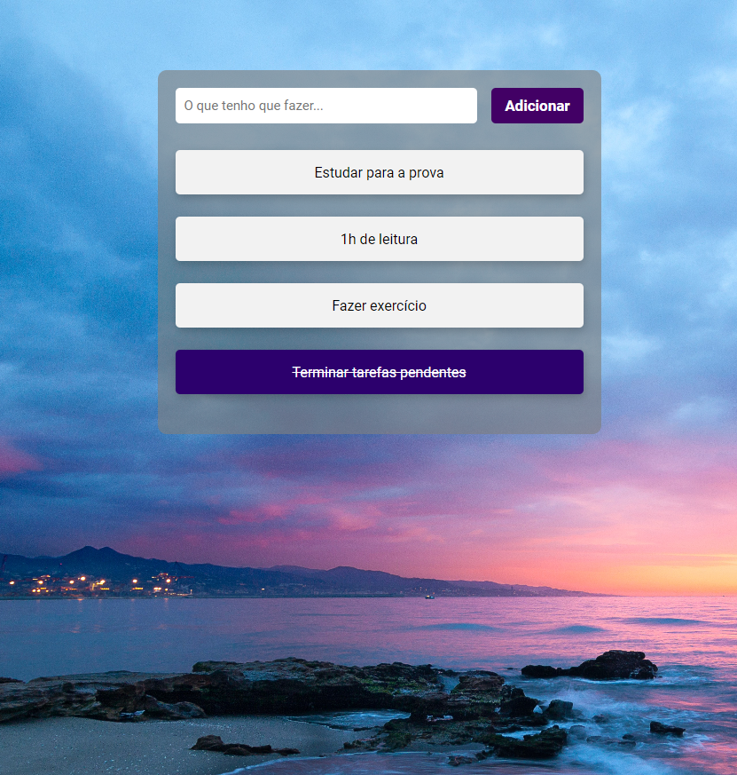

# To do List

Projeto que simula uma To do List, reponsável por organizar suas pendencias adicionando ou removendo tarefas. Tal aplicação também é capaz de armazenar os dados inseridos em uma Local Storage, logo, as tarefas adicionadas ficarão salvas caso a página for recarregada

[ 🔗 Clique aqui para acessar ](https://rafaeloshima.github.io/To-do-List/)

## 💻 Tecnologias

- HTML
- CSS
- JavaScript
- Git e Github

## 📩 Contato

yoshiaki_oshima@outlook.com
